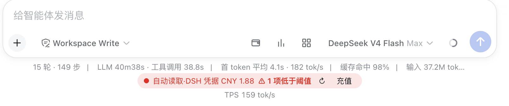
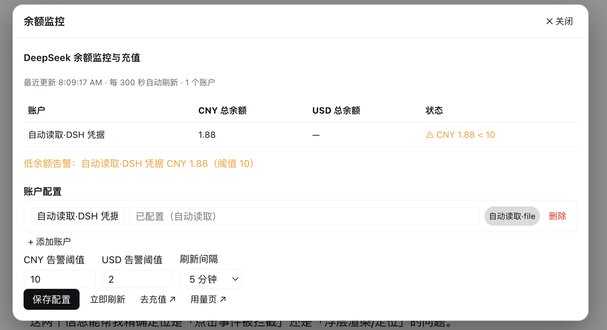
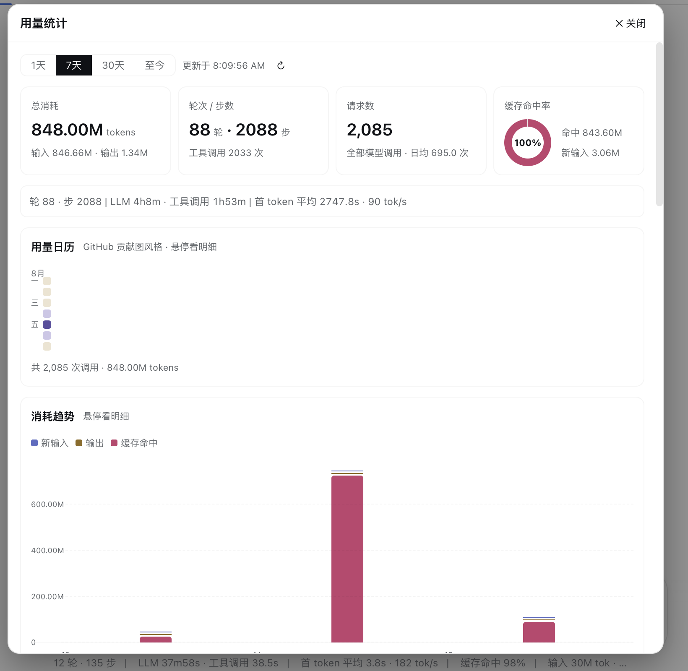
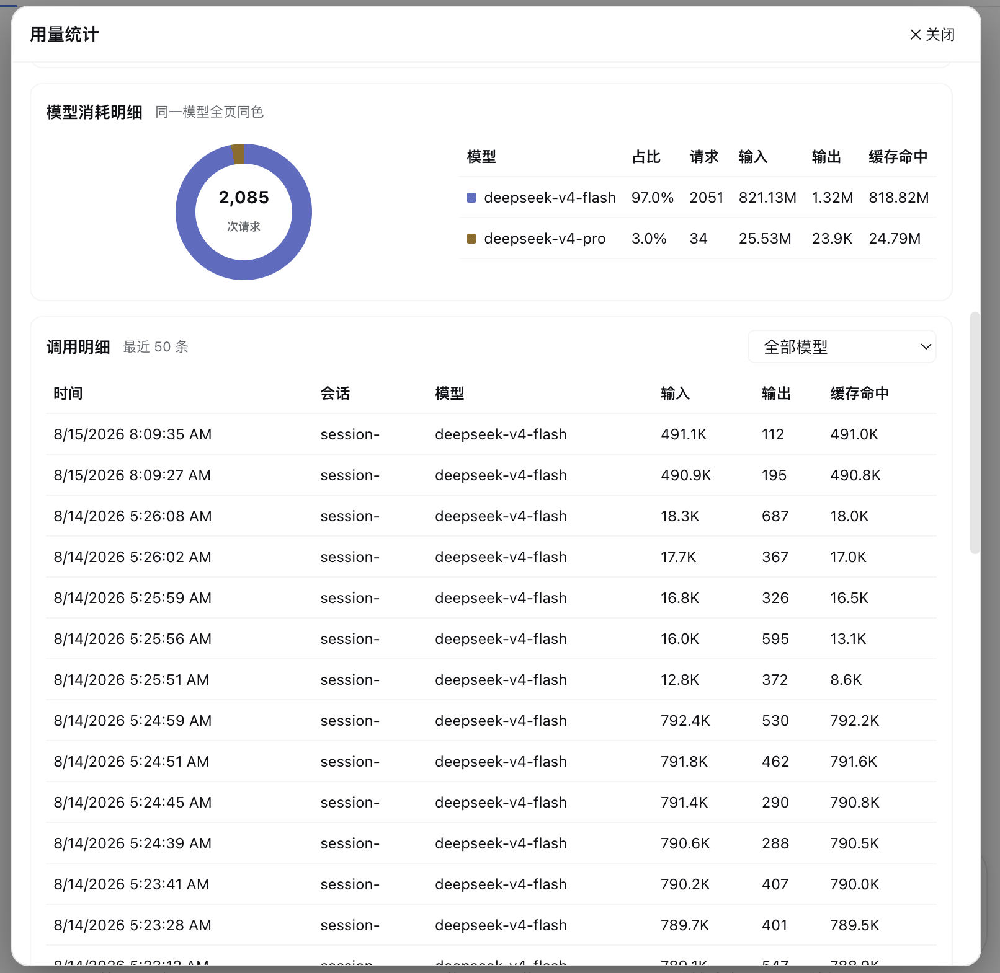
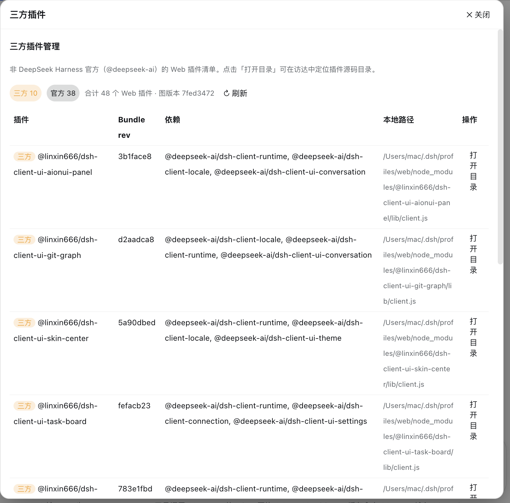
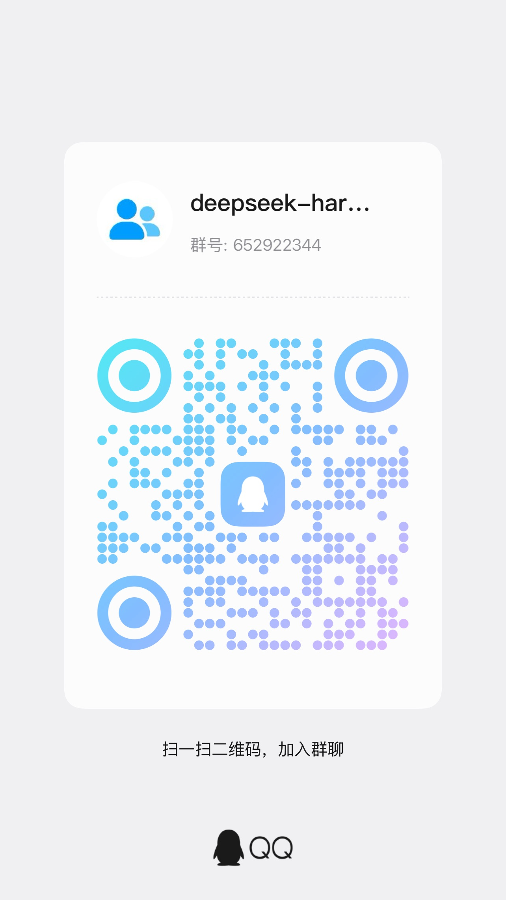

<div align="center">

# 💰 DeepSeek 余额监控与用量统计

**DeepSeek Harness（DSH）动态 Cordis 插件** —— 余额监控 · 官方充值入口 · Miyu 风格用量统计 · 三方插件管理

[](LICENSE)
[](https://github.com/Francis-Xavier-code/dsh-balance-plugin)
[](#-安装)
[](https://github.com/Francis-Xavier-code/dsh-balance-plugin)

[✨ 功能](#-功能) · [🖼 界面预览](#-界面预览) · [📥 安装](#-安装) · [⚙️ 配置](#️-配置) · [🎮 使用](#-使用) · [🗑 卸载](#-卸载) · [🏗 架构](#-架构) · [❓ FAQ](#-常见问题)

</div>

---

## ✨ 功能

| 模块 | 能力 |
| --- | --- |
| **余额监控** | 监控 DeepSeek API 余额（CNY / USD 双余额池），支持多账户并行查询；自动读取 DSH 凭据 `DEEPSEEK_API_KEY`（覆盖环境变量 / 凭据文件各来源层），**无需手动填写** |
| **低余额告警** | CNY / USD 独立阈值（默认 ¥10 / $2，可配置），低于阈值时余额条标红 + Host 日志告警 |
| **一键充值** | 直接打开 DeepSeek 官方充值页 `platform.deepseek.com/top_up`，另有用量明细页入口 |
| **用量统计** | 1:1 复刻 [Miyu WebUI 用量页](https://github.com/SHORiN-KiWATA/Miyu/tree/main/web)：统计瓦片 / GitHub 贡献图风格用量日历 / 三段堆叠趋势柱状图 / 模型消耗环形图与明细表 / 最近 50 条调用记录 |
| **性能指标** | 轮次 · 步数 · LLM 时长 · 工具调用时长 · 首 token 平均延迟 · tok/s · 缓存命中率（会话事件实时聚合，近 90 天历史扫描） |
| **三方插件管理** | 列出所有非官方（非 `@deepseek-ai`）Web 插件：包名 / 本地路径 / Bundle rev / 依赖，一键「打开目录」在访达中定位源码 |
| **模型工具** | 注册 `query_api_quota` 工具，直接问"DeepSeek 余额还剩多少"即可得到余额摘要 |

**界面配色**：图表采用 Miyu 的 chart / heat 色板（蓝 / 金 / 玫红 / 紫 + 蓝紫热力色阶），自动适配深色 / 浅色主题。

---

## 🖼 界面预览

| 截图 | 说明 |
| --- | --- |
|  | 输入框工具行右侧三个图标入口（💰 钱包 / 📊 用量 / 🧩 三方插件）与下方常驻余额条 |
|  | 余额监控面板：余额表格、低余额告警、账户配置（添加 / 清除 / 删除 Key）、阈值与刷新间隔、充值入口 |
|  | 用量统计页顶部：范围切换、4 个统计瓦片（总消耗 / 轮次·步数 / 请求数 / 缓存命中率环）、live 性能指标条、GitHub 风格用量日历 |
|  | 用量统计页底部：消耗趋势柱状图（新输入 / 输出 / 缓存命中三段）、模型消耗明细（环形图 + 模型表）、调用记录明细 |
|  | 三方插件管理：官方 / 三方统计徽章、插件清单（路径 / rev / 依赖）、「打开目录」操作 |

---

## 📥 安装

### 前置条件

- 已安装并运行 **DeepSeek Harness**（Web GUI）
- （可选）一个 DeepSeek API Key —— 可在 [platform.deepseek.com](https://platform.deepseek.com) 获取；
  若本机 DSH 已配置过 `DEEPSEEK_API_KEY` 凭据（环境变量或凭据文件），插件启动时会**自动读取，无需任何手动输入**

### 方式零：一键远程安装（推荐）

```bash
# 安装（自动：装依赖 → 写组合 patch → 提示重启）
curl -fsSL https://raw.githubusercontent.com/Francis-Xavier-code/dsh-balance-plugin/main/install.sh | bash
```
```bash
# 卸载（移除依赖 + 清理组合 patch）
curl -fsSL https://raw.githubusercontent.com/Francis-Xavier-code/dsh-balance-plugin/main/uninstall.sh | bash
```
## QQ交流群

<div align="center">
  
</div>

脚本会依次执行：`dsh plugin --profile web add`（默认使用 pnpm 的 **`github:Francis-Xavier-code/dsh-balance-plugin`** 协议——git clone + pack，哈希稳定，重装/换机不会报完整性错误；GitHub 动态 tarball 会触发 `ERR_PNPM_TARBALL_INTEGRITY`，仅作最后兜底。默认不走 npm registry：其上存在他人同名包 `dsh-balance-plugin@0.1.0`，可避免装错包）→ 幂等追加用户层 patch `~/.dsh/cordis.patch.yml` → 提示重启 DeepSeek Harness。

- 指定 profile：`DSH_PROFILE=<name>`（默认 `web`）
- 显式从 registry 安装（如未来发布 scoped 包后）：`PKG=@Francis-Xavier-code/dsh-balance-plugin curl -fsSL ... | bash`
- 脚本已容错 pnpm 的 build-scripts 策略提示（`ERR_PNPM_IGNORED_BUILDS`）：以依赖是否写入 profile 为准，不因噪音退出

### 方式一：会话内激活（动态插件）

本插件同时提供 DSH 的**会话级动态 Cordis 插件**形态（仓库根 `host.js` / `client.js`）：无需安装 npm 包、无需改配置文件，在任意会话中让 Agent 加载源码并激活即可。

**Step 1** —— 打开一个 DSH 会话

**Step 2** —— 让 Agent 创建插件，发送以下提示词（把 `<仓库路径>` 换成实际路径）：

```text
从 <仓库路径>/dsh-balance-plugin/host.js 与 client.js 读取源码，
用 cordis_define 定义插件（code.host = host.js 内容，code.client = client.js 内容），
然后用 cordis_run 激活。
```

Agent 会自动完成 `cordis_define` → `cordis_run` 流程。

**Step 3** —— 浏览器端授权：运行涉及浏览器端 UI，会在运行卡片上出现**授权请求**，点击「允许」即可。

**Step 4** —— 确认激活成功：运行卡片显示状态、输入框下方出现常驻余额条，即安装完成。

> 手动方式：也可直接在会话中通过 `cordis_define` 工具填入 `host.js` / `client.js` 的内容（两个文件都是完整的 Cordis Plugin 函数体），再 `cordis_run`。

### 方式二：dsh 命令行（标准静态插件包）

本仓库同时提供**标准 npm 包形态**（`lib/` 静态双面插件）：Host 端为 ESM cordis 插件（`lib/index.js`，RPC 走 `ctx.webServer` 的 `/bmon/api/*` 路由），Client 端为 ModuleLoader bundle（`lib/client.js`），通过 `dsh.bundle.patch` + `dsh.client` 声明接入。

**Step 1** —— 安装依赖（二选一）：

```bash
# 已发布到 npm：
dsh plugin --profile web add dsh-balance-plugin

# 或本地开发安装：
dsh plugin --profile web add link:<仓库路径>
```

**Step 2** —— 将插件行加入用户层组合 patch（追加到 `~/.dsh/cordis.patch.yml`）：

```yaml
- insert:
    - id: dsh-balance-plugin
      name: 'dsh-balance-plugin'
```

**Step 3** —— 重启 DeepSeek Harness。

**Step 4** —— 验证：输入框右侧出现三个图标按钮即生效；也可用 `dsh --profile web --dump-config` 检查组合树中是否包含 `dsh-balance-plugin`。

> 注意：静态版与动态版（方式一）同时存在会出现两套 UI。推荐二选一：用静态版时先在会话中 `cordis_undefine` 移除动态版。

---

## ⚙️ 配置

点击**输入框工具行右侧的钱包图标（💰）**打开「余额监控」面板：

| 配置项 | 说明 |
| --- | --- |
| **账户列表** | 「+ 添加账户」新增；每个账户可设名称与 API Key |
| **API Key 输入** | 直接填明文 Key，或填 `$env:环境变量名` 引用（如 `$env:DEEPSEEK_API_KEY`）；已有 Key 的账户留空表示保持不变 |
| **自动读取账户** | 启动时若检测到 DSH 凭据 `DEEPSEEK_API_KEY`，自动生成「自动读取·DSH 凭据」账户（带来源徽标），删除后本次运行不再自动加回 |
| **CNY / USD 告警阈值** | 对应币种余额低于阈值时触发低余额告警（默认 ¥10 / $2） |
| **刷新间隔** | 30 秒 ~ 30 分钟（默认 5 分钟）；「保存配置」即立即刷新一次 |

> 🔒 密钥安全：API Key 仅保存在本机插件进程内存中，不会上传任何第三方；界面只显示掩码。

---

## 🎮 使用

| 入口 | 位置 | 说明 |
| --- | --- | --- |
| 💰 钱包图标 | 输入框工具行右侧 | 打开余额监控面板（配置 / 余额 / 充值） |
| 📊 柱状图图标 | 输入框工具行右侧 | 打开用量统计面板 |
| 🧩 四格图标 | 输入框工具行右侧 | 打开三方插件管理面板 |
| 常驻余额条 | 输入框下方 | 实时余额摘要（`DeepSeek CNY xxx · USD xxx`）、↻ 刷新、充值链接；低余额时整条标红 |
| `query_api_quota` 工具 | 模型调用 | 直接问"DeepSeek 余额还剩多少"，返回 Miyu 同格式余额摘要 |

面板均为居中浮层：点击遮罩或「✕ 关闭」退出，再次点击对应图标可切换 / 关闭。

---

## 🗑 卸载

### 方式一：临时停用（保留版本，可随时恢复）

```text
cordis_stop → 插件 id（bmon-1）
```

停止后插件 UI 与轮询全部移除，但插件定义、版本与授权保留；需要时用 `cordis_run` 直接重新激活，无需重新定义。

### 方式二：彻底移除

```text
cordis_undefine → 插件 id（bmon-1）
```

永久删除插件全部版本与授权记录，运行卡片保留「Plugin removed」历史标记。

### 方式三：什么都不做（自动消失）

动态插件**不持久化**：DSH 进程重启后插件自动消失，不残留任何代码或配置（`~/.dsh` 下不会新增文件）。

---

## 🏗 架构

```
┌─ Host（Node.js 进程）──────────────────────────────────────────────┐
│ · 余额查询：shell 服务执行 curl → api.deepseek.com/user/balance    │
│   （Bearer 鉴权，Key 支持明文 / $env: 引用 / 凭据服务自动解析）     │
│ · 用量聚合：session/event 实时监听 + sessionQuery 90 天历史扫描     │
│   （按 seq 去重；聚合轮次/步数/时长/首token/输入输出缓存token）     │
│ · 三方插件：clientModules.graph() + clientPath() + open -R 定位    │
│ · 私有 RPC：get-state / refresh / recharge / set-config /           │
│   get-usage / list-plugins / open-plugin-dir                       │
│ · 模型工具：query_api_quota                                        │
└────────────────────────────────────────────────────────────────────┘
┌─ Client（浏览器）──────────────────────────────────────────────────┐
│ · 入口：输入框工具行右侧 3 个 SVG 图标按钮                          │
│ · 浮层：组件内 useState 自渲染 fixed 面板（不依赖 overlay 槽位，    │
│   规避了受限环境下的跨组件状态与槽位渲染问题）                      │
│ · 图表：Miyu chart/heat 色板，深色/浅色自适应                      │
└────────────────────────────────────────────────────────────────────┘
```

---

## ❓ 常见问题

**Q：DSH 重启后插件不见了？**
A：正常现象。动态插件定义在进程内存中，重启即清除；按[安装](#-安装)步骤重新激活即可（配置也需重新填写）。

**Q：侧边栏底部看不到入口按钮？**
A：DSH 的侧边栏底部插槽会被官方 Cordis 面板插件（`cordis-panel`）独占整行，其他条目不可见。本插件入口固定在**输入框工具行右侧**，不依赖该插槽。

**Q：Key 会泄露吗？**
A：不会。Key 只保存在本机插件进程内存，界面仅显示掩码；源码与 README 中不含任何密钥。

**Q：余额查询失败？**
A：检查面板中的错误提示：未配置 Key（`未配置 API Key`）、环境变量缺失（`未设置环境变量 xxx`）、Key 无效（401 错误信息）等，对应处理即可。

**Q：用量统计为何没有历史数据？**
A：插件启动时扫描近 90 天会话事件；「首 token 平均」仅统计插件运行后实时捕获的流式数据（历史日志不回溯 token 级事件）。

**Q：可以用 `dsh plugin add` 安装吗？**
A：可以。仓库同时提供标准静态插件包形态（`lib/`），按[安装](#-安装)方式二执行：`dsh plugin --profile web add dsh-balance-plugin` + 用户层 patch 一行 + 重启 DSH。

---

## 📄 许可

[MIT](LICENSE) © 2026 [Black Cat (Francis-Xavier-code)](https://github.com/Francis-Xavier-code)
